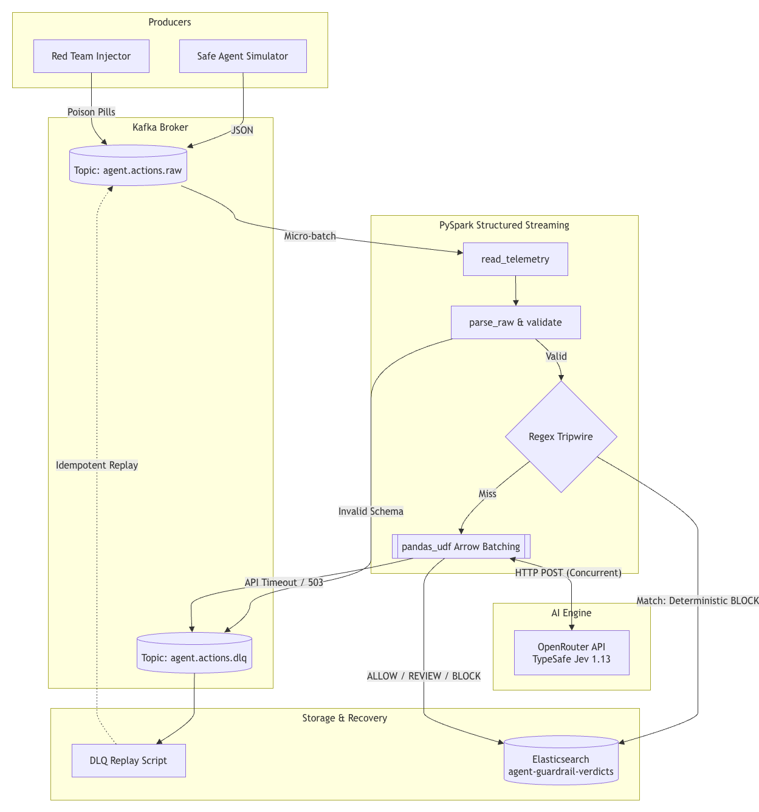

# AgentLeash

AI agents are incredibly useful right up until they try to run `DROP DATABASE`. AgentLeash is a real-time circuit breaker that sits between autonomous agents and your infrastructure. It intercepts tool calls (like SQL queries or shell commands) on the fly, scores them for risk, and blocks destructive actions in milliseconds.

## The Pipeline

1. **Ingestion:** Agents stream their telemetry as Pydantic-validated JSON to a **Confluent Kafka** topic.
2. **Interception:** A **PySpark Structured Streaming** job pulls the events. It runs a quick regex tripwire check for obvious attacks.
3. **Scoring:** Surviving events are batched and sent to the **Jev 1.13 Decisions API** (a fast, System-One model) to get a strict `ALLOW`, `REVIEW`, or `BLOCK` verdict.
4. **Storage:** The verdicts are sunk into **Elasticsearch** so security teams can actually query what the agents are trying to do.

## Why it's built this way

* **Batching for speed:** Calling an API row-by-row in Spark is a bottleneck. I used `pandas_udf` to batch rows into Arrow tables and hit the API concurrently using thread pools.
* **Idempotency over exactly-once:** Two-phase commits are fragile. Instead, the pipeline maps the Kafka `event_id` directly to the Elasticsearch `_id`. If Spark crashes and restarts, it just overwrites the same document. No duplicates.
* **Fail-closed:** If the scoring API times out or throws a 503, the pipeline doesn't crash or let the payload through. It defaults to a `REVIEW` verdict, tags it as degraded, and kicks it to a Dead Letter Queue (DLQ) for replay later.

## Running it locally (No Docker Required)

You don't need cloud credentials or Docker to test the pipeline logic. The repo includes a lightweight Python mock server to simulate the API and inject faults.



```bash
# 1. Install dependencies
pip install -r requirements-dev.txt

# 2. Start the mock API server in Terminal 1
python mock/jev/server.py

# 3. Run the PySpark interceptor in Terminal 2
AGENTLEASH_ENV_FILE=.env.compose python -m src.streaming.jev_interceptor

# 4. Fire simulated agent traffic in Terminal 3
AGENTLEASH_ENV_FILE=.env.compose python -m src.producers.safe_agent_simulator


